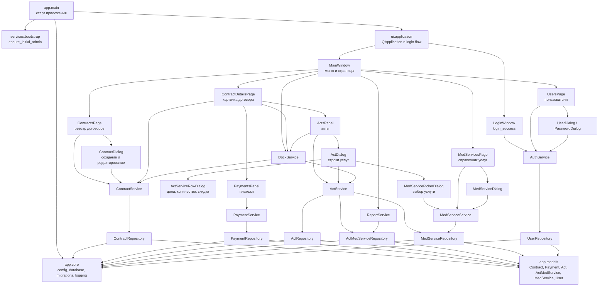
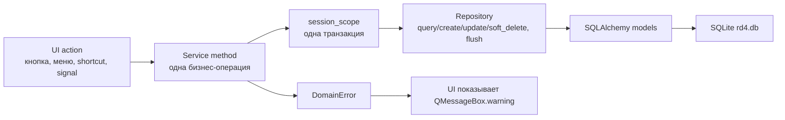

# Схема модулей и сигналов

Эта схема показывает основные зависимости между слоями приложения и наиболее важные UI-сигналы. Направление зависимостей остается прежним: `ui -> services -> repositories -> models/core`.

## Слои и модули



## Основные UI-сигналы

```mermaid
sequenceDiagram
    participant App as ui.application
    participant Login as LoginWindow
    participant Main as MainWindow
    participant Contracts as ContractsPage
    participant Details as ContractDetailsPage
    participant Payments as PaymentsPanel
    participant Acts as ActsPanel
    participant ActDialog as ActDialog
    participant Picker as MedServicePickerDialog
    participant Services as services

    App->>Login: показать окно входа
    Login->>Services: AuthService.login()
    Login-->>App: login_success(user)
    App->>Main: открыть MainWindow(user)

    Main->>Contracts: стартовая страница
    Contracts->>Services: ContractService.list_contracts()
    Contracts->>Services: ContractService.list_contract_summaries()

    Contracts-->>Contracts: search_input.textChanged -> _apply_filter()
    Contracts-->>Contracts: filters.currentIndexChanged -> _apply_filter() / reload()
    Contracts-->>Contracts: table.selectionChanged -> _update_selection()

    Contracts-->>Main: table.doubleClicked / open_button.clicked
    Main->>Details: open_contract_details(contract_id)
    Details->>Payments: создать вкладку платежей
    Details->>Acts: создать вкладку актов

    Payments-->>Payments: add_payment_button.clicked -> PaymentDialog
    Payments->>Services: PaymentService.create_payment() / create_refund() / update_payment()
    Payments->>Services: PaymentService.unpost_payment()

    Acts-->>ActDialog: create_button.clicked / open_button.clicked
    ActDialog-->>Picker: add_service_button.clicked
    Picker-->>ActDialog: accepted(selected_service)
    ActDialog->>Services: ActService.create_act() / update_act()
    ActDialog->>Services: ActService.add_service()
    Note over ActDialog,Services: Если услуга и скидка совпадают, количество увеличивается вместо новой строки.

    Details-->>Main: back_button.clicked
    Main->>Contracts: reload(), focus_contract(contract_id)
```

## Поток данных и транзакций


